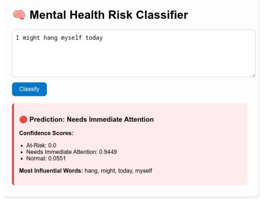

# 🧠 Mental Health Risk Classifier

A full-stack AI system to **classify social media mental health-related text** into three risk levels:

- **Normal**
- **At-Risk**
- **Needs Immediate Attention**

This project combines **Natural Language Processing (NLP)** and a **custom deep learning model (MLP)** using PyTorch. It detects potential mental health crises in user-generated content — with real-world applications in **wellness platforms**, **mental health triaging**, and **online content moderation**.

---

## 🚀 Features

- 🧩 **Data Preprocessing**: Cleans and normalizes mental health text data; maps mental health conditions to 3 simplified risk levels.
- 📊 **Feature Engineering**: Uses TF-IDF vectorization and Label Encoding for structured input.
- 🤖 **Custom Neural Network**: Built and trained a Multilayer Perceptron (MLP) with PyTorch achieving over **94% accuracy** on critical cases.
- 🔍 **Model Insight**: Shows most influential words and per-class confidence scores.
- 🌐 **Deployment Interfaces**:
  - ✅ **Gradio App** for quick local demos.
  - ✅ **Flask Web App** for browser-based interaction using HTML/CSS and Jinja2.
- 💾 **Persistence**: Stores trained model, vectorizer, and label encoder using `torch.save` and `joblib`.

---

## 📁 Project Structure

```
sentiment-analysis/
├── dataset/
│   └── Combined Data.csv
├── models/
│   └── mental_health_model.pth
├── web app/                     # Flask app directory
│   ├── app.py                   # Flask backend
│   ├── static/
│   │   └── style.css            # Custom styling
│   └── templates/
│       └── index.html           # UI with Jinja2 templating
├── sentiment-analysis.ipynb     # Full notebook for preprocessing + training
├── tfidf_vectorizer.pkl
├── label_encoder.pkl
└── README.md
```

---

## 🛠️ Tech Stack

- **Python 3.10+**
- **PyTorch** for deep learning
- **Scikit-learn** for preprocessing and evaluation
- **Flask** for backend web serving
- **Gradio** for rapid UI prototyping
- **HTML/CSS + Jinja2** for Flask frontend
- **Pandas, NumPy, Matplotlib, Seaborn** for data analysis & visualization

---

## 📦 Installation

1. **Clone the repository**:
   ```bash
   git clone https://github.com/YOUR_USERNAME/mental-health-risk-classifier.git
   cd mental-health-risk-classifier
   ```

2. **Install dependencies**:
   ```bash
   pip install -r requirements.txt
   ```

---

## 🧪 Sample Predictions

```python
samples = [
    "I feel hopeless and tired of everything.",
    "I'm doing fine, just had a busy week.",
    "I’ve been thinking about ending it all lately."
]
```

**Model Output**:

```
Post: I feel hopeless and tired of everything.
 → Prediction: Needs Immediate Attention

Post: I'm doing fine, just had a busy week.
 → Prediction: Normal

Post: I’ve been thinking about ending it all lately.
 → Prediction: Needs Immediate Attention
```

---

## 🎮 Run the App

### Option 1: Gradio Demo (Quick Testing)

```bash
jupyter sentiment-analysis.ipynb
```

Visit [http://localhost:7860](http://localhost:7860) in your browser.

---

### Option 2: Flask Web App (UI with Explanation)

```bash
cd "web app"
python app.py
```

Then go to [http://127.0.0.1:5000](http://127.0.0.1:5000) to access the app.

- Displays:
  - ✅ Predicted risk level with emoji
  - ✅ Confidence scores for all classes
  - ✅ Most influential words from the input text

---

## 📌 Future Improvements

- Deploy Flask API on a cloud service (Heroku, Render, etc.)
- Add explainability tools (e.g., SHAP, LIME)
- Continuous training based on user feedback
- Integrate messaging alerts (Slack, Discord)

---

## 🧠 Ethical Note

This tool is a prototype and **not a replacement for professional help**. Use it responsibly and always consult qualified mental health professionals for any serious concerns.

---

## 📝 License

MIT License © 2025 Ibrahim Dayax
